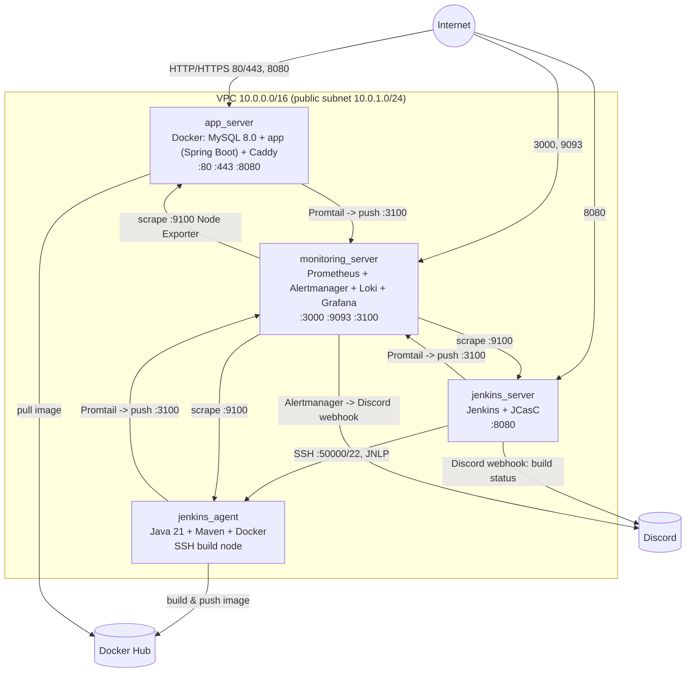

# Dokumentacja techniczna — `learnit-project-devops-infra`

## 1. Przegląd architektury

Projekt stawia w AWS (region `eu-central-1`) cztery maszyny EC2 w jednej sieci VPC i konfiguruje je automatycznie przez Ansible:



| Serwer | Rola | Kluczowe porty |
|---|---|---|
| `app_server` | Aplikacja (Docker) + MySQL 8.0 + reverse proxy Caddy | 22, 80, 443, 8080, 9100 |
| `jenkins_server` | Kontroler Jenkins (JCasC) | 22, 8080, 9100, 50000 (tylko od agenta) |
| `jenkins_agent` | Dedykowany agent budujący (Maven, Docker) | 22, 9100 |
| `monitoring_server` | Prometheus, Alertmanager, Loki, Grafana | 22, 3000, 3100, 9093, 9100 |

---

## 2. Stos technologiczny

- **Chmura:** AWS (EC2, VPC, Security Groups), backend stanu Terraform w S3 (`learnit-project-terraform-state-bucket`, z blokowaniem stanu przez `use_lockfile`)
- **IaC:** Terraform ≥ 1.0, provider `hashicorp/aws ~> 4.0`
- **Zarządzanie konfiguracją:** Ansible + Ansible Vault
- **CI/CD:** Jenkins skonfigurowany jako kod (JCasC), plugin `job-dsl` do auto-tworzenia multibranch pipeline
- **Konteneryzacja:** Docker + Docker Compose (plugin)
- **Reverse proxy / TLS:** Caddy 2 (automatyczny HTTPS dla domeny DuckDNS)
- **Baza danych:** MySQL 8.0 (kontener `db`, wolumen trwały `db-data`)
- **Monitoring:** Prometheus + Node Exporter + Alertmanager
- **Logi:** Loki + Promtail
- **Dashboardy:** Grafana (auto-provisioning źródeł danych Prometheus + Loki)
- **Powiadomienia:** Alertmanager
- **DNS dynamiczny:** DuckDNS (aktualizacja rekordu IP przy każdym provisioningu `app_server`)

---

## 3. Struktura repozytorium

```
.
├── main.tf                      # 4 instancje EC2 (for_each po mapie serwerów) + key pair
├── network.tf                   # VPC, subnet, internet gateway, route table
├── security.tf                  # 4 security groups + reguły ingress/egress
├── variables.tf                 # zmienne Terraform (typy instancji, AMI, SSH ...)
├── outputs.tf                   # IP publiczne/prywatne + generowanie inventory.ini
├── providers.tf                 # provider AWS + backend S3
├── moved.tf                     # mapowanie serwerów
├── .gitignore
├── .terraform.lock.hcl
└── ansible/
    ├── ansible.cfg               # inventory=./inventory.ini, vault_password_file=.vault_pass
    ├── inventory.ini             # generowany automatycznie przez Terraform (outputs.tf)
    ├── inventory.tmpl            # szablon dla inventory.ini
    ├── playbook.yml              # 6 playów: webservers, jenkins_agent, jenkins, monitoring, node_exporter, promtail
    ├── files/
    │   └── plugins.txt           # lista pluginów Jenkins instalowanych przez Plugin Manager CLI
    ├── group_vars/
    │   ├── all.yml                # zaszyfrowany Ansible Vault (sekrety)
    │   └── all.yml.example        # wzór/dokumentacja zmiennych do wypełnienia
    └── templates/
        ├── docker-compose.yml.j2              # app_server: db + app + caddy
        ├── docker-compose-monitoring.yml.j2   # monitoring_server: prometheus + alertmanager + loki + grafana
        ├── jenkins-casc.yaml.j2                # pełna konfiguracja Jenkins jako kod
        ├── prometheus.yml.j2                   # cele scrape'owania generowane z inventory Ansible
        ├── alert-rules.yml.j2                  # reguły alertowe Prometheusa
        ├── alertmanager.yml.j2                 # routing alertów do Discorda
        ├── loki-config.yaml.j2                 # konfiguracja Loki (filesystem, TSDB)
        ├── promtail-config.yaml.j2             # zbieranie logów kontenerów Dockera
        └── grafana-datasources.yml.j2          # auto-konfiguracja źródeł danych Grafany
```

---

## 4. Warstwa infrastruktury (Terraform)

### 4.1 Sieć (`network.tf`)
- VPC `10.0.0.0/16` z włączonym DNS (`enable_dns_support`, `enable_dns_hostnames`)
- Jedna publiczna podsieć `10.0.1.0/24` (`map_public_ip_on_launch = true`)
- Internet Gateway + tablica routingu z trasą domyślną `0.0.0.0/0`

### 4.2 Instancje (`main.tf`)
Cztery serwery zdefiniowane deklaratywnie w `local.servers` i tworzone jedną pętlą `for_each`:

| Klucz w `local.servers` | Zmienna typu instancji | Security Group | Tag `Name` |
|---|---|---|---|
| `app` | `var.instance_type` (domyślnie `t3.small`) | `web_sg` | LearnIT-DevOps-Server |
| `monitoring` | `var.monitoring_instance_type` | `monitoring_sg` | LearnIT-Monitoring-Server |
| `jenkins` | `var.jenkins_instance_type` | `jenkins_sg` | LearnIT-Jenkins-Server |
| `jenkins_agent` | `var.agent_instance_type` | `jenkins_agent_sg` | LearnIT-Jenkins-Agent |

Wszystkie instancje używają tego samego AMI (Ubuntu 24.04 LTS, `ami-042dc8681de073ac4` — region-specific) i tej samej pary kluczy SSH, generowanej z lokalnego `~/.ssh/id_rsa.pub` (`aws_key_pair.deployer`).

### 4.3 Security Groups (`security.tf`)
Każda reguła jest osobnym zasobem `aws_security_group_rule` (świadoma decyzja projektowa — mieszanie stylu inline z osobnymi regułami dla tej samej grupy powodowałoby "flapping" reguł przy każdym `apply`).

| Grupa | Ingress | Źródło |
|---|---|---|
| `web_sg` (app) | 22 | `var.ssh_allowed_cidr` |
| | 80, 443, 8080 | `0.0.0.0/0` |
| | 9100 (Node Exporter) | tylko `monitoring_sg` |
| `monitoring_sg` | 22 | `var.ssh_allowed_cidr` |
| | 3000 (Grafana), 9093 (Alertmanager) | `0.0.0.0/0` |
| | 3100 (Loki push) | `web_sg`, `jenkins_sg`, `jenkins_agent_sg` |
| | 9100 | `monitoring_sg` (self, dla własnego Node Exportera) |
| `jenkins_sg` | 22 | `var.ssh_allowed_cidr` |
| | 8080 (UI) | `0.0.0.0/0` |
| | 9100 | tylko `monitoring_sg` |
| | 50000 (JNLP agenta) | tylko `jenkins_agent_sg` |
| `jenkins_agent_sg` | 22 | `jenkins_sg` **oraz** `var.ssh_allowed_cidr` (dwie osobne reguły) |
| | 9100 | tylko `monitoring_sg` |

Wszystkie cztery grupy mają pełny egress (`0.0.0.0/0`, wszystkie protokoły).

**Uwaga bezpieczeństwa:** `var.ssh_allowed_cidr` domyślnie ustawiony jest na `0.0.0.0/0` (SSH otwarty dla całego internetu).

### 4.4 Zmienne i outputy
- `variables.tf` definiuje region, typy instancji (domyślnie wszędzie `t3.small`), AMI, nazwę pary kluczy i CIDR dla SSH.
- `outputs.tf` eksportuje publiczne/prywatne IP wszystkich czterech maszyn **i** generuje plik `ansible/inventory.ini` z szablonu `inventory.tmpl` (zasób `local_file.ansible_inventory`) — dzięki temu Ansible zawsze ma aktualne adresy bez ręcznej edycji.
- Backend stanu: S3 (`providers.tf`), bucket `learnit-project-terraform-state-bucket`, blokowanie stanu przez natywny mechanizm `use_lockfile` (bez osobnej tabeli DynamoDB).

---

## 5. Warstwa konfiguracji (Ansible)

`ansible/playbook.yml` zawiera sześć playów wykonywanych sekwencyjnie:

### 5.1 Play `webservers` (tag `webserver`) — `app_server`
1. Instalacja Docker CE + plugin Compose (oficjalne repo Docker).
2. Utworzenie `/opt/learnit-app`, wgranie `docker-compose.yml` z szablonu.
3. Start **tylko** kontenerów `db` i `caddy` (`docker compose up -d db caddy`) — kontener `app` **nie** jest tu uruchamiany; to zadanie Jenkinsa (deploy stage w `Jenkinsfile`, w drugim repo). Baza danych jest więc stawiana raz przy provisioningu i żyje niezależnie od kolejnych wdrożeń appki.
4. Aktualizacja rekordu DuckDNS (`duckdns_domain`, `duckdns_token`) — **te dwie zmienne nie są udokumentowane w `all.yml.example`**, trzeba je dodać ręcznie do zaszyfrowanego `all.yml`, inaczej to zadanie zawiedzie (`failed_when: "'OK' not in duckdns_result.content"`).
5. Firewall UFW: 22, 80, 443, 8080, 9100.

### 5.2 Play `jenkins_agents` (tag `jenkins_agent`)
- Java 21 (JRE), Maven, Docker CE.
- Katalog roboczy `/home/ubuntu/agent`.
- UFW: 22, 9100.
- To ten host wykonuje `mvn` (build) oraz `docker build`/`push` w pipeline'ie CI/CD.

### 5.3 Play `jenkins_servers` (tag `jenkins`)
- Java 21, instalacja Jenkinsa z oficjalnego repo APT (`pkg.jenkins.io`, klucz `2026.key`).
- Docker CE (użytkownik `jenkins` dodany do grupy `docker`, żeby pipeline mógł budować/pushować obrazy z kontrolera, jeśli zajdzie taka potrzeba).
- Odczyt i wyświetlenie initial admin password (istotne tylko przy pierwszym uruchomieniu, zanim JCasC przejmie realm bezpieczeństwa).
- Instalacja pluginów listą z `files/plugins.txt` przez **Jenkins Plugin Manager CLI** (wersja 2.13.2), nie przez UI.
- Wdrożenie **JCasC** (`jenkins-casc.yaml.j2`) do `/var/lib/jenkins/casc_configs/jenkins.yaml`, wpięcie zmiennej środowiskowej `CASC_JENKINS_CONFIG` przez systemd override, restart Jenkinsa i health-check `/login` (do 30 prób co 10s).

**Zawartość JCasC** (szczegóły w sekcji 6).

### 5.4 Play `monitoring` (tag `monitoring`) — `monitoring_server`
- Docker CE + Compose.
- Renderowanie i wgranie konfiguracji: `prometheus.yml`, `alert-rules.yml`, `alertmanager.yml`, `loki-config.yaml`, `grafana-datasources.yml`, `docker-compose.yml`.
- `docker compose pull` + `up -d`; selektywny restart Prometheusa/Alertmanagera **tylko gdy** ich config się zmienił (`register` + `when: ...changed`) — więc powtórne uruchomienia playbooka są idempotentne i nie generują zbędnych restartów.
- UFW: 22, 3000, 3100, 9093, 9100.

### 5.5 Play `node_exporter` (tag `node_exporter`, `hosts: all`)
- Pobiera i instaluje Node Exporter v1.8.1 na **wszystkich czterech** maszynach jako usługę systemd — to jest źródło metryk CPU/RAM/dysku scrape'owanych przez Prometheusa.

### 5.6 Play `promtail` (tag `promtail`, `hosts: webservers:jenkins_servers:jenkins_agents`)
- Uruchamia kontener `grafana/promtail:2.9.8` na trzech maszynach (nie na `monitoring_server` — tam Loki działa jako odbiorca).
- `loki_push_host` wyliczany dynamicznie z `hostvars` pierwszego hosta grupy `monitoring` (prywatny IP).
- Czyta logi wszystkich kontenerów Dockera (`/var/lib/docker/containers/*/*log`), parsuje JSON i wysyła do Loki.
- Logika idempotencji: kontener jest usuwany i tworzony od nowa tylko jeśli configu jeszcze nie ma albo się zmienił.

---

## 6. CI/CD — Jenkins jako kod (JCasC)

Cała konfiguracja Jenkinsa (`ansible/templates/jenkins-casc.yaml.j2`) jest deklaratywna:

- **`numExecutors: 0`, `mode: EXCLUSIVE`** na kontrolerze — buildy nigdy nie odpalają się na samym kontrolerze, tylko na agencie.
- **Węzeł SSH** `docker-agent-1` wskazujący na `jenkins_agent`, launcher SSH z `nonVerifyingKeyVerificationStrategy` 
- **Security realm:** lokalny użytkownik `{{ jenkins_admin_user }}` / `{{ jenkins_admin_password }}` (z Vault), autoryzacja przez `globalMatrix` (admin ma pełne prawa, `anonymous` tylko odczyt).
- **Credentials** rejestrowane globalnie:
  - `docker-hub-credentials` — login/hasło (token) do Docker Hub
  - `github-token` — do skanowania repo aplikacji (multibranch) i ewentualnie prywatnego repo
  - `aws-ec2-ssh-key` — klucz prywatny wczytywany z pliku wskazanego przez `ssh_private_key_path`, używany zarówno przez launcher SSH agenta, jak i przez `Jenkinsfile` do wdrożenia na `app_server`
  - `discord-webhook-url` — sekret typu string, do powiadomień
- **Auto-tworzenie joba** przez plugin `job-dsl`: `multibranchPipelineJob('learnit-app')` wskazujący na `{{ app_repo_owner }}/{{ app_repo_name }}` (domyślnie `Zegzus/learnit-project-devops-app`), skanowanie co 5 minut, historia ograniczona do 10 ostatnich buildów.

Sam `Jenkinsfile` (logika: build Mavenem na agencie → obraz Docker z tagiem numeru builda → push do Docker Hub → `docker compose pull app && docker compose up -d app` na `app_server` → powiadomienie Discord) znajduje się w repozytorium aplikacji, nie w tym repo.

---

## 7. Monitoring i logowanie

| Komponent | Rola | Dostęp |
|---|---|---|
| **Node Exporter** (:9100, na każdej maszynie) | Metryki systemowe (CPU, RAM, dysk, load) | tylko z `monitoring_sg` |
| **Prometheus** | Scrape'uje wszystkie cztery `:9100` co 15s; cele generowane dynamicznie z `hostvars` Ansible | wewnętrzny (za Grafaną/Alertmanagerem) |
| **Alertmanager** (:9093) | Routing alertów → Discord (przez trik "Discord akceptuje payload Slacka pod `/slack`") | publiczny |
| **Grafana** (:3000) | Dashboardy; źródła danych (Prometheus + Loki) auto-provisionowane, brak ręcznej konfiguracji po `ansible-playbook` | publiczny |
| **Loki** (:3100) | Agregacja logów | tylko z `web_sg`, `jenkins_sg`, `jenkins_agent_sg` |
| **Promtail** | Zbiera logi kontenerów Dockera na `app`, `jenkins`, `jenkins_agent` i wysyła do Loki | — (klient) |

### Reguły alertowe (`alert-rules.yml.j2`)
| Alert | Warunek | Poziom |
|---|---|---|
| `InstanceDown` | `up{job="node_exporter"} == 0` przez 1 min | critical |
| `HighMemoryUsage` | dostępna pamięć < 10% przez 5 min | warning |
| `HighDiskUsage` | wolne miejsce na `/` < 15% przez 5 min | warning |
| `HighLoadAverage` | `node_load1 > 4` przez 5 min (stały próg, dostosowany do małych instancji 1–2 vCPU) | warning |

---

## 8. Zarządzanie sekretami

- Wszystkie wrażliwe wartości trzymane są w `ansible/group_vars/all.yml`, szyfrowanym przez **Ansible Vault** (AES256) — plik jest bezpieczny do commitowania w tej postaci.
- `all.yml.example` dokumentuje wymagane klucze: `jenkins_admin_user/password`, `dockerhub_user/pass`, `github_username/token`, `mysql_root_password`, `grafana_admin_password`, `discord_webhook_url`, `ssh_private_key_path`, `app_repo_owner/name`, `dockerhub_repo`.


---

## 9. Uruchomienie środowiska od zera

```bash
# 1. Infrastruktura: 4 instancje EC2 + VPC + security groups
terraform init
terraform apply
# -> generuje automatycznie ansible/inventory.ini

# 2. Sekrety (jednorazowo, na maszynie kontrolującej Ansible)
cd ansible
cp group_vars/all.yml.example group_vars/all.yml
nano group_vars/all.yml              # wypełnić prawdziwymi wartościami
ansible-vault encrypt group_vars/all.yml

# 3. Konfiguracja wszystkich czterech maszyn
ansible-playbook -i inventory.ini playbook.yml --ask-vault-pass
```


Po zakończeniu:
- **Jenkins:** `http://<jenkins_public_ip>:8080` — login z `jenkins_admin_user` / `jenkins_admin_password`
- **Grafana:** `http://<monitoring_public_ip>:3000` — `admin` / `grafana_admin_password`
- **Aplikacja:** `http://<app_public_ip>:8080` (lub przez Caddy pod domeną DuckDNS na 80/443) — dostępna dopiero po pierwszym udanym pushu do `main` w repo aplikacji, bo wtedy Jenkins po raz pierwszy buduje i pushuje obraz do Docker Hub.

Selektywne uruchamianie fragmentów konfiguracji jest możliwe dzięki tagom: `--tags webserver`, `jenkins_agent`, `jenkins`, `monitoring`, `node_exporter`, `promtail`.

---